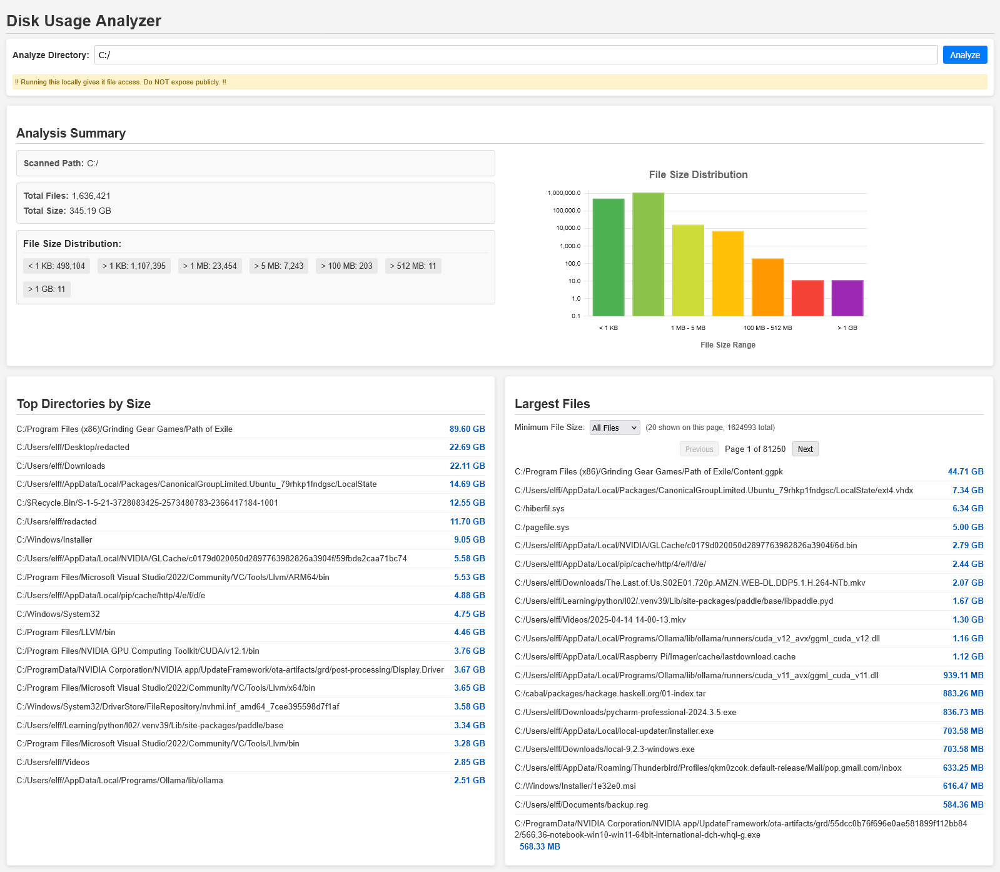

# Disk Viewer
A web-based tool to analyze disk usage for a specified directory. It provides a summary of files, total size, file size distribution, and lists of the largest directories and files.





## Features

* Scan a specified directory path on the server.
* Display a summary including total file count and total size.
* Visualize file size distribution across different size ranges using a chart.
* Show a list of the largest directories by total aggregated size (including subdirectories).
* Show a list of the largest individual files.
* Filter the list of large files by a minimum size threshold.
* Paginate the list of filtered files for easier Browse.
* Simple and intuitive web interface.


## Requirements

This project consists of a frontend (HTML, CSS, JavaScript) and uses the default Go Http server to serve the frontend and access the filesystem.

The backend exposes an API endpoint (as used by the frontend, e.g., `/api/analyze`) that accepts a directory path as a parameter and returns JSON data containing:

* `scannedPath`: The path that was scanned.
* `fileCount`: Total number of files.
* `totalSize`: Total size of all files in bytes.
* `sizeCounts`: An object detailing file counts in specific size bins (e.g., `{ countLess1KB: ..., countMore1KB: ..., ... }`).
* `files`: An array of file objects, each with at least `name` (full path) and `size` (bytes).


## How to Run

1.  **Clone the repository:**
    ```bash
    git clone https://github.com/elf-lambda/disk-viewer.git
    cd disk-viewer
    ```

2.  **Set up and run the backend:**
    ```bash
    go run .
    ```
3. **Go to localhost:8080**

4.  **Enter a directory path:**
    In the input field, enter the path to the directory you want to analyze (this path must be accessible by the backend server).

5.  **Click "Analyze":**
    The application will fetch data from the backend API and display the results.

## Technical Details

* **Frontend:** HTML, CSS, JavaScript
* **Backend:** Go
* **Visualization:** Uses Chart.js for the file size distribution chart.

## License

This project is licensed under the MIT License - see the [LICENSE](LICENSE) file for details.

